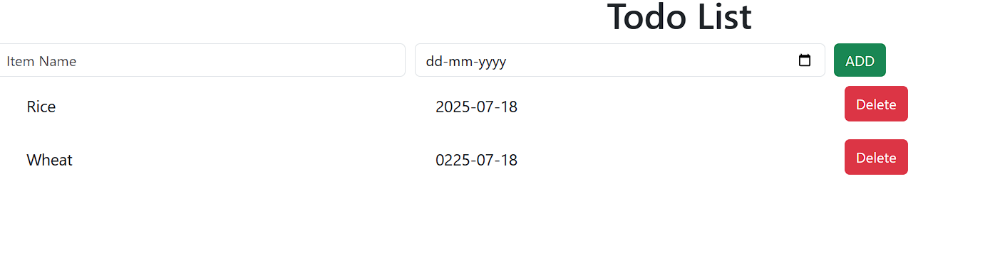

# React + Vite

# ✅ ToDo List App using React

A simple and interactive **ToDo List App** built with **React JS**. You can add, delete, and mark tasks as completed. It's clean, fast, and responsive!

---

## 🚀 Features

- 📝 Add new tasks
- ✅ Mark tasks as completed
- 📱 Responsive UI
- 🔄 Real-time updates with React Hooks

---

## 🛠️ Tech Stack

- React JS
- HTML5 & CSS3
- JavaScript (ES6+)
- React Hooks (`useState`, `useEffect`)

---

## 🔗 Live Demo

[🌐 Click here to view the live app](https://AslamKhanpathan142.github.io/todo-list-react/)

## 📸 Screenshots

